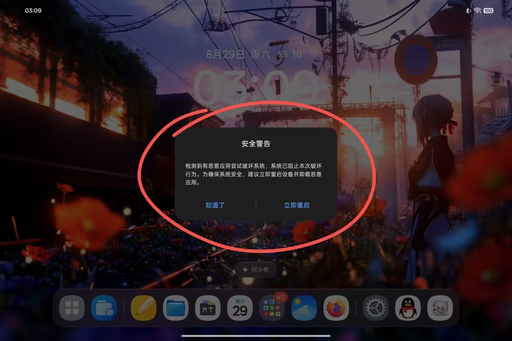

# OPD2515 Anti-root Dialog Blocker

[English](README.en.md)

一个仅针对 OPPO Pad Mini OPD2515 特定 ColorOS 版本的现代 libxposed API 102 模块。它屏蔽 `OplusAntiRootDialogService` 创建的普通反 Root 警告和 15 秒强制重启对话框，同时保留 SecureGuard 的内核检测、kevent 日志以及 `OplusExSystemService` 的其他功能。模块格式遵循 [官方 libxposed API](https://github.com/libxposed/api) 与 [LSPosed 现代模块开发说明](https://github.com/LSPosed/LSPosed/wiki/Develop-Xposed-Modules-Using-Modern-Xposed-API)。

## 问题示例



这是未启用模块拦截时的原始警告界面。模块的目标是阻止该对话框及其强制重启定时器，而不是关闭底层 SecureGuard 检测。

## 兼容范围

- 设备：OPPO Pad Mini `OPD2515`
- 已验证系统：`OPD2515_16.0.10.500(CN01)`
- 目标包：`com.oplus.exsystemservice`
- 目标 APK SHA-256：`7EC5BC4F1BB6E3A06694B4593622263641E3F5A01C486D1301CB49F0E22D34A9`
- 现代 Xposed API：102
- 已验证 LSPosed：`2.1.1 (7790)`
- 静态作用域：仅 `com.oplus.exsystemservice`

系统 OTA 很可能改变目标 APK 哈希或混淆类名。哈希不一致时不要默认继续使用，应重新完成静态分析和实机验证。

## 工作方式

当前目标版本的 anti-root Binder 服务入口为 `v6.b$j.g0(int)`，两个最终显示分支为：

- `v6.b.x(...)`：15 秒后调用 `PowerManager.reboot(...)` 的强制重启型对话框；
- `v6.b.y(...)`：由用户选择是否重启的普通警告对话框。

模块在目标进程内把这三个 void 方法短路。因此事件仍可由 SecureGuard 检测和记录，但不会创建对话框或启动 15 秒重启定时器。模块不会修改 OpenSSH、systemd、Root 管理器或厂商 APK。

## 安装

1. 从项目 Release 下载已签名 APK并安装。
2. 在 LSPosed 中启用模块。
3. 在作用域中勾选系统服务 `com.oplus.exsystemservice`。仓库已声明静态作用域，不应额外勾选其他应用。
4. 重启目标系统服务进程或重启设备。
5. 检查日志：

```text
OPD2515-AntiRootDialogBlocker: active; hooks=3
```

若看到 `failed to install hooks`，说明目标版本不兼容，应停用模块并重新分析，不要扩大作用域。

## 构建

需要 JDK 17、Android SDK Platform 35；最低 Android API 为 29。Gradle wrapper 会下载固定的 Gradle 8.10.2，libxposed API 以 `compileOnly` 方式从 Maven Central 获取，不会打包进 APK。

```bash
./gradlew :app:assembleDebug
python3 scripts/verify-apk.py app/build/outputs/apk/debug/app-debug.apk
```

Windows：

```powershell
.\gradlew.bat :app:assembleDebug
python .\scripts\verify-apk.py .\app\build\outputs\apk\debug\app-debug.apk
```

`assembleRelease` 默认产生未签名 APK。公开仓库和 CI 不保存私钥；正式发布应在受控环境中使用固定私钥签名，并保存证书指纹供以后升级。

已部署验证的预开源 v1.1 APK SHA-256：

```text
05BF20984B6DBA23F9928FCABC460CF01837416D3FCAF1098AAE5DD514CFF656
```

由当前公开源码构建并使用同一证书签名的候选 APK SHA-256：

```text
58440010AA6E4668E280C5C57FF0139648CFAAFAE00AE3C805C051520D4D64BE
```

后者已通过构建、lint、APK 元数据和签名检查，但尚未重新安装到目标设备验证；发布前请完成一次安装和目标服务重启测试。固定签名证书 SHA-256 为 `E994D8F4AC2CC760311506AD5DD803F87AAFE28839BE97DF5660C12A88DB4651`。

## 风险说明

该模块会隐藏厂商的反 Root 安全警告，包括真实恶意提权和误报使用同一入口时的提示。它适合明确了解设备 Root 状态、且希望避免已确认误报的用户，不应被描述为提升系统安全性。

模块失配通常只会导致 Hook 安装失败，但任何作用于系统服务的 LSPosed 模块理论上都可能造成目标进程崩溃或系统异常。保留可禁用 LSPosed 模块的恢复手段。

验证范围和未验证项见 [验证报告](docs/VALIDATION.zh-CN.md)。

## 不包含的内容

- OPPO/OPlus 的目标 APK或反编译源码；
- LSPosed 框架、Manager 或数据库；
- APK 签名私钥；
- 除 README 中已检查无 EXIF 的问题示例图外，不包含原始设备日志、调试转储、网络信息或账户数据。

## 许可证

原创模块源码采用 [Apache License 2.0](LICENSE)。libxposed API 仅作为 `compileOnly` 依赖并保留其自身许可证。

OPPO、OPlus、ColorOS、Android、LSPosed 与 libxposed 名称及商标归各自权利人所有。本项目与这些厂商或项目没有隶属关系。
